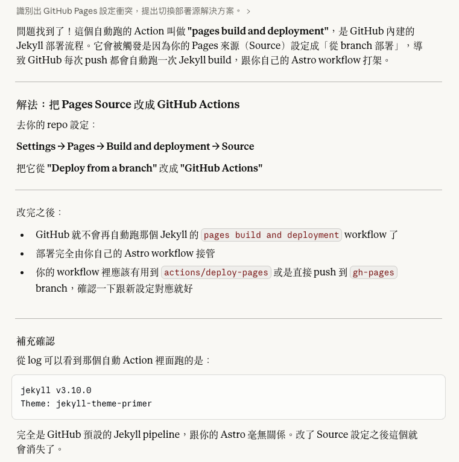
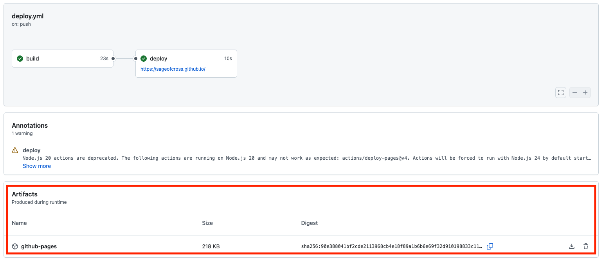

趁著自己還記憶猶新，打算記錄一下這次的部落格重建。

## 相關技術
先快速介紹一下使用的：

- Astro ：關注有一段時間了，只是拖著不去碰，現在有這大好機會怎能不碰呢？
- Cactus ：我很喜歡的主題，感謝 _chrismwilliams_ 的[搬移](https://github.com/chrismwilliams/astro-theme-cactus)
- GitHub Page ：全球最大軟體程式設計師交友網站的免費功能，偉大無需多言
- GitHub Action ：為 GitHub 的 CI/CD 功能

## 過程的困惑
即便有了 AI 整個過程也還是有踩到一些坑，來分別說說。

### Astro
相較於 SSG （ Static Site Generation ），我認為 Astro 給了更多能力，或者可以說更少束縛。

這是研究如何更新與替換主題時，訝異 Astro 竟然沒有內建支援，這代表當主題更新或者你想換風格的時候，得自己去看程式碼做變更。最初我不敢置信，但隨著研究才逐漸了解 Astro 本質是 Web Framework 。

:::tip[Web Framework != SSG]
如果說 Web Framework 是工具箱，那 SSG 只是一種特定的**工具用法**。不同主題可能用了**不同的工具**，故彼此之間無法隨意替換
:::

### GitHub Action
持續出現不認識的 GitHub Action 在跑還出現錯誤，明明我根本就沒有設定 GitHub Action ，於是馬上請教 Claude 老師：

原來現在 GitHub Page 多了部署設定，如果用 Branch 部署就會自動使用 Jekyll 的方式處理，我當下只有：「原來 Jekyll 紅到足以被當成預設部署模式嗎？」

修改後我使用了 Astro 官方維護的 [GitHub Action](https://github.com/withastro/action) 就成功地看到了網站。

### GitHub Page
記憶中只要是特定名字的 Repository （ `<username>.github.io` ）且有 `index.html` 就能變成網站。所以之前流程都是本地編譯為 HTML 後推送到 GitHub 。

然而 Astro 的 Action 跑完之後 Repository 完全沒變⋯⋯

我混亂了，完全不懂 Astro 為什麼能運作。「啊 index.html 哩？」、「編譯後的檔案存到哪去了？」

查了一下發現目前有兩種模式，其中一個就是我熟悉的版本 `gh-pages` ：

| 模式 | 會 Commit 編譯檔案？ | 原理 |
| :-: | :-: | :-: |
| gh-pages | 會 | 獨立分支存編譯後的檔案 |
| artifact | 否 | 上傳編譯後的檔案到 GitHub 而非 Repository 內 |

回到 GitHub Action 頁面，隨便點一個 Workflow 就會看到最下方 Artifacts 的 `github-pages` 可以下載，解壓縮就能看到編譯後的產物。

到這邊就很容易理解了，對於 GitHub Pages 來說只是差別在去分支抓或者是去 Artifact 抓而已。

## 感受
時間真的過得好快，不知不覺之間好多東西都改變了。

深刻感受到學習真的是稍微停下就容易被拉開差距。大概也是這樣的時代人們才需要 AI 吧，時間的硬限制讓我們只能不斷最佳化學習的路途。
